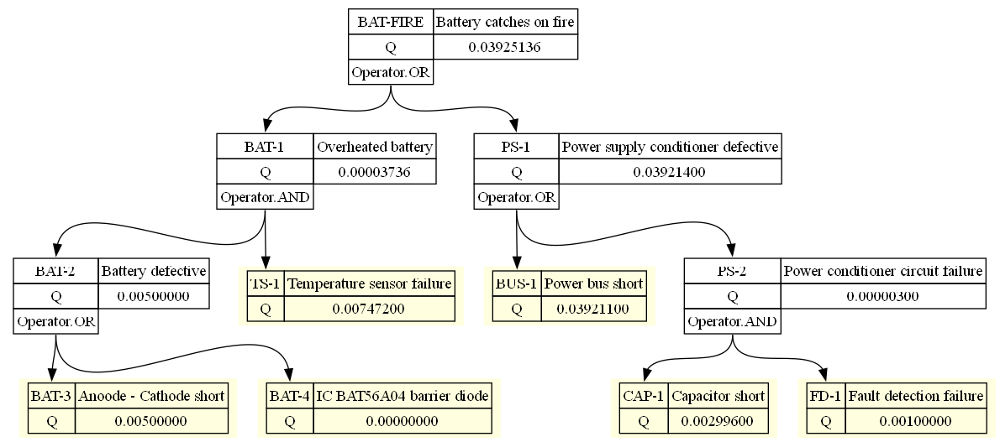

# Fault Tree Analysis
Simple program that generates Graphviz output for an FTA tree as descriped in a JSON object. It propagates all probabilities from the basic events to intermediate gated events. One example has been provided and running

```
python pyfta.py -o out -f png example.json
```

produces



# TODO
Implement all the symbols and operations
https://en.wikipedia.org/wiki/Fault_tree_analysis